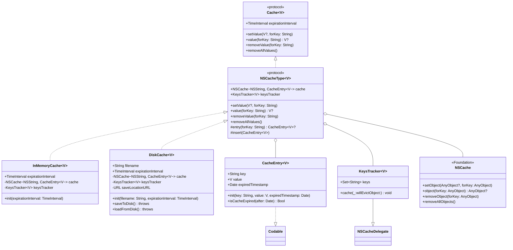

# 🗺 CacheKit

Cache is a lightweight disk caching tool commonly used to store data returned from network requests.

# Quick Start

1、Init cache

```Swift
import Cache

let cache = DiskCache<[YOUR_CODABLE_MODEL]>(filename:"YOUR_FILE_NAME", expirationInterval: 30 * 24 * 60 * 60)
```

2、Write cache to disk

```swift
cache.setValue(channels, forKey: keyString)
try? await cache.saveToDisk()

```

3、Load cache from disk

```Swift
cache.loadFromDisk()
```

4、Remove cache from disk

```swift
cache.removeValue(forKey: keyString)
```

# Class Diagram


